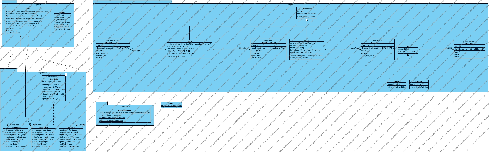

# Marmota Mobilidade

## Capa
**Nome da Solução:** Marmota Mobilidade  
**Integrantes:**  
- João Vinicius Alves (559560)
- Juan Pablo (560445)
- Matheus Mariotto (560276)

---

## Sumário
1. [Descrição da Solução](#descricao-da-solucao)
2. [Funcionalidades](#funcionalidades)
3. [Protótipo](#prototipo)
4. [Diagrama de Classes (UML)](#diagrama-de-classes-uml)

---

## Descrição da Solução
A solução **Marmota Mobilidade** tem como objetivo facilitar o gerenciamento de falhas e geração de relatórios para auxiliar a manutenção e operação de sistemas de transporte. A aplicação permite que operadores registrem falhas e administrem os dados de forma organizada, otimizando a tomada de decisões.

Através de um sistema intuitivo, os usuários podem cadastrar falhas, visualizar relatórios e acompanhar a resolução dos problemas de maneira eficiente.

---

## Funcionalidades

### Cadastro de Falhas
Permite que os operadores registrem falhas ocorridas no sistema de transporte, categorizando-as e atribuindo status.

### Geração de Relatórios
Os administradores podem gerar relatórios detalhados sobre falhas registradas no sistema.

### Gerenciamento de Usuários
Permite que administradores adicionem e removam usuários no sistema.

---

## Protótipo
### Tela de Login

**Descrição:** O usuário insere suas credenciais para acessar o sistema.

### Tela de Cadastro de Falhas

**Descrição:** Permite que o operador registre uma nova falha, selecionando o tipo e adicionando uma descrição.

### Tela de Relatórios

**Descrição:** Exibe um resumo das falhas registradas e permite gerar relatórios detalhados.

---

## Diagrama de Classes (UML)

O diagrama de classes apresenta a estrutura do sistema, definindo as relações entre as entidades e os métodos utilizados.

---

## Conclusão
O projeto **Marmota Mobilidade** busca otimizar o registro e a análise de falhas nos sistemas de transporte, melhorando a eficiência operacional e a tomada de decisões. Com uma interface intuitiva e um backend robusto, ele possibilita um gerenciamento eficiente e automatizado das falhas registradas.
