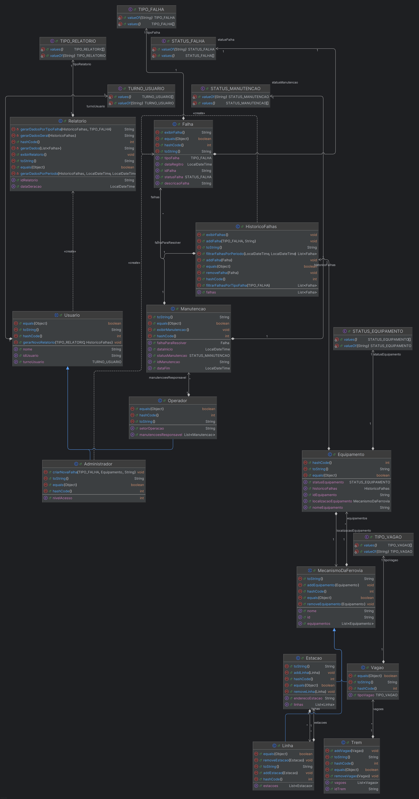

# Sistema de Histórico de Falhas do CCO
> Projeto desenvolvido em parceira da CCR como Challenge da FIAP 2024

---

## Representantes
- João Vinicius Alves (559369)
- Juan Pablo (560445)
- Matheus Barbosa (XXXXXX)

---

## Descritivo
- ### Introdução
  O objetivo desse projeto é de criar um sistema que possa diminuir o trabalho manual e otimizar a gestão de falhas dos Centros de Controle de Operações (CCO), proporcionando uma maneira eficiente  registrar e acompanhar as falhas em trens, estações e equipamentos. 

- ### Objetivos
   Dentro do sistema teremos dois tipos de usuários: Operadores e Administradores.  

   - Usuários poderão: Ver/gerar novos relatórios e checar históricos de falhas;
   - **_Apenas_** administradores poderão: Gerenciar falhas (Criar, remover, alterar).  

  O sistema é organizado em:
  1. Equipamentos: Cada equipamento terá um histórico de falhas e cada estação/trem/linha terão vários equipamentos;
  2. Falhas: Cada falha representa uma ocorrência no sistema;
  3. Histórico de falha: Organizará as falhas;
  4. Relatório: Exibir um conteúdo geral do sistema de acordo com um histórico de falha.

---

- ### Classes
  

  1. #### Administrador
     _Atributos_: (Herda Usúario), nivel de acesso;

  2. #### Equipamento
     _Atributos_: ID de equipamento, nome do equipamento, localização do equipamento, status do equipamento, histórico de falhas;
   
  3. #### Estação
     _Atributos_: (Herda Mecanismo da Ferrovia), endereço da estação, linhas da estação;

  4. #### Falha
     _Atributos_: ID da falha, tipo de falha, descricao da falha, data de registro, status da falha;

  5. #### Histórico de Falhas
     _Atributos_: lista de falhas;

  6. #### Linha
     _Atributos_: (Herda Mecanismo da Ferrovia), estações da linha;

  7. #### Mecanismo da Ferrovia
     _Atributos_: ID, nome, lista de equipamentos;

  8. #### Operador
     _Atributos_: (Herda Usúario), setor de operação, lista de manutenções;

  9. #### Relatório
     _Atributos_: ID do relatório, tipo de relatório, data de geração, dados do relatório;

  10. #### Trem
      _Atributos_: ID do trem, lista de vagões;

  11. #### Usuário
      _Atributos_: ID de usuário, nome, turno;

  12. #### Vagão
      _Atributos_: (Herda Mecanismo da Ferrovia), tipo de vagão;

  13. #### Enuns do sistema
      - Status do equipamento( ATIVO, INATIVO, EM_MANUTENCAO, COM_FALHA, DESCARTADO );
      - Status da falha( EM_ANALISE, PENDENTE, RESOLVIDA, CANCELADA );
      - Tipo de falha( MECANICA, ELETRICA, SOFTWARE, COMUNICACAO, HUMANA, REDE_CONECTIVIDADE, SENSOR, AMBIENTAL, SEGURANCA, INFRAESTRUTURA, CONTROLE, OUTRO );
      - Tipo de relatório( GERAL, PERIODO, TIPO_DE_FALHA );
      - Tipo de vagão( CARGA, PASSAGEIRO, TANQUE, GONDOLA, PLATAFORMA, FRIGORIFICO, BOVINO, POSTAL );
      - Turno do usuário( MANHA, TARDE, NOITE );

---